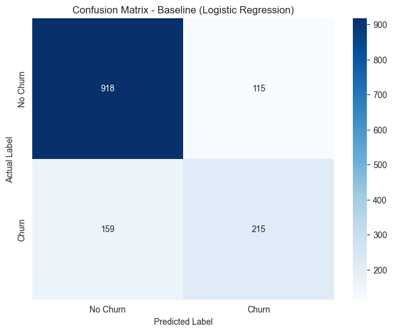
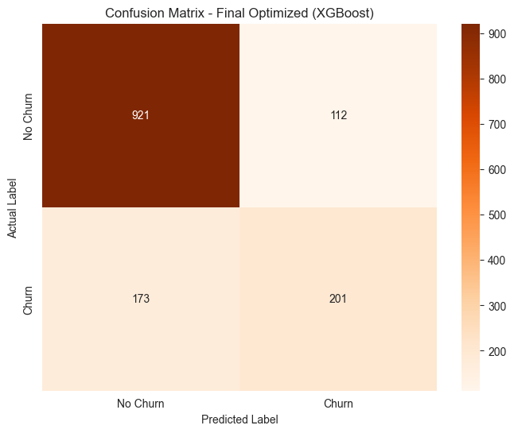

# Advanced Churn Prediction with XGBoost

### A project focused on building, comparing, and tuning machine learning models to predict customer churn, featuring a deep dive into XGBoost.


## Project Overview

This project moves beyond baseline modeling to explore advanced techniques for solving a critical business problem: customer churn. The primary goal is to compare a simple, interpretable model (Logistic Regression) with a powerful, industry-standard algorithm (XGBoost) to determine the most effective approach.

The core of the project is a methodical, scientific approach to model building:
1.  Establish a strong **baseline performance** with Logistic Regression.
2.  Implement an **advanced model** (XGBoost) and evaluate its out-of-the-box performance.
3.  Perform **hyperparameter tuning** on the advanced model using GridSearchCV to unlock its full potential.
4.  **Compare all three models** to make a data-driven decision on the best solution.

## Key Skills & Techniques Demonstrated

*   **Advanced Modeling:** Implementation of the **XGBoost** algorithm for a classification task.
*   **Hyperparameter Tuning:** Using `GridSearchCV` to systematically find the optimal parameters for a model.
*   **Model Comparison:** A methodical evaluation and comparison of multiple models.
*   **Feature Scaling:** Applying `StandardScaler` as a crucial preprocessing step.
*   **End-to-End ML Workflow:** Demonstrates the complete process from data preparation to final evaluation.

## Key Findings & Conclusion

Interestingly, for this specific dataset, the simpler **Logistic Regression baseline model achieved the best overall performance** (F1-Score of 0.61). While the optimized XGBoost model improved upon its default configuration, it did not manage to outperform the baseline.

This highlights a critical lesson in data science: **model complexity does not always guarantee superior results**. Establishing a strong, simple baseline is crucial, as a well-performing, simpler model is often preferable due to its interpretability and efficiency.

| Metric (for "Churn" class) | Logistic Regression | XGBoost (Default) | XGBoost (Optimized) |
| :--- | :---: | :---: | :---: |
| **Accuracy** | 81% | 78% | 80% |
| **Precision** | 65% | 59% | 64% |
| **Recall** | 57% | 55% | 54% |
| **F1-Score** | 0.61 | 0.57 | 0.59 |

## How to Run This Project

1.  **Clone the repository:**
    ```bash
    git clone https://github.com/takzen/advanced-churn-prediction.git
    cd advanced-churn-prediction
    ```
2.  **Create a virtual environment and install dependencies:**
    ```bash
    uv venv
    source .venv/bin/activate
    uv pip install -r requirements.txt
    ```
3.  **Run the Jupyter Notebook** (`churn_xgboost_model.ipynb`).

## Visualizations Showcase



*Confusion Matrix for the winning baseline model (Logistic Regression).*



*Confusion Matrix for the final, tuned XGBoost model.*